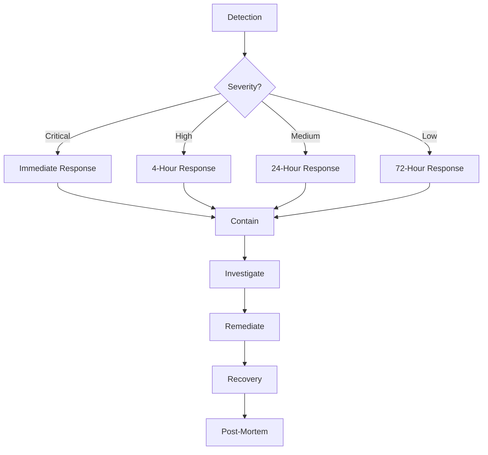

# Business Hunter Security Documentation

## Overview

The Business Hunter Swarm System implements defense-in-depth security architecture following OWASP guidelines and enterprise security best practices. This document outlines security controls, procedures, and compliance measures.

## Security Architecture

### Layers of Security

```
┌─────────────────────────────────────────────────────────┐
│                    External Layer                         │
│  • WAF (Web Application Firewall)                       │
│  • DDoS Protection                                      │
│  • Geographic IP Filtering                              │
└─────────────────────────────────────────────────────────┘
                           │
┌─────────────────────────────────────────────────────────┐
│                  Authentication Layer                     │
│  • API Key Management                                   │
│  • JWT Token Validation                                 │
│  • OAuth 2.0 (future)                                  │
└─────────────────────────────────────────────────────────┘
                           │
┌─────────────────────────────────────────────────────────┐
│                  Authorization Layer                      │
│  • Role-Based Access Control (RBAC)                    │
│  • Permission Validation                                │
│  • Resource-Level Security                              │
└─────────────────────────────────────────────────────────┘
                           │
┌─────────────────────────────────────────────────────────┐
│                    Network Layer                          │
│  • TLS 1.3 Encryption                                  │
│  • Certificate Pinning                                  │
│  • VPC Network Isolation                               │
└─────────────────────────────────────────────────────────┘
                           │
┌─────────────────────────────────────────────────────────┐
│                  Application Layer                        │
│  • Input Validation & Sanitization                     │
│  • Output Encoding                                     │
│  • CSRF Protection                                     │
│  • Security Headers                                    │
└─────────────────────────────────────────────────────────┘
                           │
┌─────────────────────────────────────────────────────────┐
│                     Data Layer                            │
│  • Encryption at Rest (AES-256-GCM)                   │
│  • Encryption in Transit (TLS 1.3)                    │
│  • Key Management (HSM)                                │
│  • Data Classification                                 │
└─────────────────────────────────────────────────────────┘
```

## Authentication & Authorization

### API Key Management

#### Key Generation
```typescript
// Secure API key generation with cryptographically secure random values
const apiKey = security.generateApiKey({
  name: 'Production Hunter Key',
  permissions: ['hunter:read', 'hunter:write', 'export:read'],
  rateLimit: 1000,
  ipWhitelist: ['10.0.0.0/8', '172.16.0.0/12'],
  expiresAt: new Date('2025-12-31')
});
```

#### Key Format
```
bh_<environment>_<key_id>_<key_secret>

Example:
bh_prod_a1b2c3d4e5f6789012345678901234567_0123456789abcdef0123456789abcdef0123456789abcdef0123456789abcdef
```

#### Key Storage
- Keys are hashed using SHA-256 before storage
- Original keys are never stored
- Metadata stored separately from hashed keys
- Regular key rotation enforced (90 days)

### JWT Tokens

Used for inter-service communication:

```typescript
// Token structure
{
  "service": "hunter-service",
  "permissions": ["discovery", "validation"],
  "iat": 1709136000,
  "exp": 1709139600,
  "jti": "unique-token-id"
}
```

### Permission Model

```typescript
enum Permissions {
  // Hunter permissions
  HUNTER_READ = 'hunter:read',
  HUNTER_WRITE = 'hunter:write',
  HUNTER_SCALE = 'hunter:scale',
  HUNTER_DELETE = 'hunter:delete',
  
  // Data permissions
  DATA_READ = 'data:read',
  DATA_EXPORT = 'data:export',
  DATA_DELETE = 'data:delete',
  
  // Admin permissions
  ADMIN_AUDIT = 'admin:audit',
  ADMIN_CONFIG = 'admin:config',
  ADMIN_KEYS = 'admin:keys'
}
```

## Input Validation & Sanitization

### Zod Schema Validation

All inputs are validated using strict Zod schemas:

```typescript
const SearchSchema = z.object({
  query: z.string().max(500).regex(/^[\w\s\-\.]+$/),
  filters: z.object({
    province: z.enum(['ON', 'BC', 'AB', /* ... */]).optional(),
    industry: z.string().max(50).optional(),
    indigenous: z.boolean().optional()
  }).optional(),
  limit: z.number().min(1).max(100).optional(),
  offset: z.number().min(0).optional()
});
```

### XSS Prevention

```typescript
// Automatic sanitization of all string inputs
function sanitizeInput(input: string): string {
  return input
    .replace(/<script\b[^<]*(?:(?!<\/script>)<[^<]*)*<\/script>/gi, '')
    .replace(/<iframe\b[^<]*(?:(?!<\/iframe>)<[^<]*)*<\/iframe>/gi, '')
    .replace(/javascript:/gi, '')
    .replace(/on\w+\s*=/gi, '')
    .trim();
}
```

### SQL Injection Prevention

- All database queries use parameterized statements
- No dynamic SQL construction
- ORMs with built-in protection (Prisma/TypeORM)

## Rate Limiting & DDoS Protection

### Rate Limiting Strategy

```typescript
// Per API key rate limiting
const rateLimits = {
  read: 1000,    // per hour
  write: 100,    // per hour
  export: 10,    // per hour
  admin: 50      // per hour
};

// Per IP rate limiting (additional layer)
const ipRateLimits = {
  unauthenticated: 100,  // per hour
  authenticated: 5000    // per hour
};
```

### DDoS Mitigation

1. **CloudFlare/AWS Shield**: First line of defense
2. **Rate limiting**: Application-level protection
3. **Circuit breakers**: Prevent cascade failures
4. **Resource limits**: CPU/memory constraints
5. **Graceful degradation**: Reduced functionality under attack

## Encryption

### Data at Rest

```typescript
// AES-256-GCM encryption for sensitive data
const encrypted = security.encrypt(sensitiveData);
// Returns: { encrypted: string, iv: string }

// Stored as:
{
  data: encrypted.encrypted,
  iv: encrypted.iv,
  algorithm: 'aes-256-gcm',
  keyVersion: 1
}
```

### Data in Transit

- TLS 1.3 minimum for all connections
- Certificate pinning for critical services
- Perfect Forward Secrecy (PFS)
- HSTS headers with preload

### Key Management

```yaml
# Key hierarchy
Master Key (HSM)
  ├── Data Encryption Keys (DEK)
  │   ├── Business Data Key
  │   ├── Personal Data Key
  │   └── Audit Log Key
  └── Key Encryption Keys (KEK)
      ├── API Key Encryption
      └── Token Signing Key
```

## Security Headers

All responses include security headers:

```typescript
const securityHeaders = {
  'Strict-Transport-Security': 'max-age=31536000; includeSubDomains; preload',
  'X-Content-Type-Options': 'nosniff',
  'X-Frame-Options': 'DENY',
  'X-XSS-Protection': '1; mode=block',
  'Content-Security-Policy': "default-src 'self'; script-src 'self' 'unsafe-inline'",
  'Referrer-Policy': 'strict-origin-when-cross-origin',
  'Permissions-Policy': 'geolocation=(), microphone=(), camera=()'
};
```

## Audit Logging

### Logged Events

All security-relevant events are logged:

```typescript
enum AuditEventType {
  // Authentication
  API_KEY_CREATED,
  API_KEY_REVOKED,
  AUTHENTICATION_SUCCESS,
  AUTHENTICATION_FAILURE,
  
  // Authorization
  ACCESS_GRANTED,
  ACCESS_DENIED,
  PERMISSION_CHANGED,
  
  // Data Access
  DATA_ACCESSED,
  DATA_EXPORTED,
  DATA_MODIFIED,
  DATA_DELETED,
  
  // Security
  SUSPICIOUS_ACTIVITY,
  RATE_LIMIT_EXCEEDED,
  SECURITY_VIOLATION,
  IP_BLOCKED
}
```

### Log Format

```json
{
  "id": "evt_1234567890abcdef",
  "timestamp": "2024-02-28T10:15:30.123Z",
  "eventType": "AUTHENTICATION_SUCCESS",
  "userId": "usr_123",
  "apiKeyId": "key_456",
  "ipAddress": "192.168.1.100",
  "userAgent": "BusinessHunter-SDK/1.0",
  "resource": "/api/businesses/search",
  "action": "SEARCH",
  "result": "success",
  "metadata": {
    "searchQuery": "construction ontario",
    "resultsReturned": 50
  },
  "riskScore": 0
}
```

### Log Retention

- Security logs: 7 years
- Access logs: 2 years
- Application logs: 90 days
- Encrypted backups: 10 years

## Vulnerability Management

### Security Scanning

```bash
# Dependency scanning (daily)
npm audit
snyk test

# SAST scanning (on commit)
semgrep --config=auto

# Container scanning (on build)
trivy image business-hunter:latest

# Infrastructure scanning (weekly)
terraform plan -var-file=prod.tfvars | tfsec
```

### Penetration Testing

- External penetration testing: Annually
- Internal security assessment: Quarterly
- Red team exercises: Semi-annually
- Bug bounty program: Continuous

### Patch Management

```yaml
# Patch schedule
Critical (CVSS 9.0+): Within 24 hours
High (CVSS 7.0-8.9): Within 7 days
Medium (CVSS 4.0-6.9): Within 30 days
Low (CVSS 0.0-3.9): Within 90 days
```

## Incident Response

### Response Plan



### Contact Information

```yaml
Security Team:
  Email: security@indigenous-platform.ca
  Phone: +1-800-SEC-TEAM
  PagerDuty: business-hunter-security

Escalation:
  Level 1: Security Engineer on-call
  Level 2: Security Team Lead
  Level 3: CISO
  Level 4: CTO
```

## Compliance Controls

### SOC2 Type II

- Annual audit by independent auditor
- Continuous monitoring of controls
- Quarterly control testing
- Evidence collection automated

### ISO 27001

- Information Security Management System (ISMS)
- Risk assessments every 6 months
- Policy reviews annually
- Internal audits quarterly

### PIPEDA Compliance

- Privacy policy published and maintained
- Consent mechanisms implemented
- Data subject rights supported
- Privacy impact assessments for new features

## Security Best Practices

### For Developers

1. **Never commit secrets**: Use environment variables
2. **Validate all inputs**: Use Zod schemas
3. **Escape all outputs**: Prevent XSS
4. **Use parameterized queries**: Prevent SQL injection
5. **Implement least privilege**: Minimal permissions
6. **Log security events**: Use audit logger
7. **Handle errors securely**: Don't leak information

### For Operations

1. **Regular updates**: Keep dependencies current
2. **Monitor alerts**: Respond to security events
3. **Backup encryption keys**: Follow key management procedures
4. **Review access**: Monthly access reviews
5. **Test incident response**: Quarterly drills
6. **Maintain documentation**: Keep runbooks updated

### For API Consumers

1. **Secure key storage**: Never expose API keys
2. **Use HTTPS only**: Reject non-TLS connections
3. **Implement retry logic**: Handle rate limits gracefully
4. **Validate certificates**: Prevent MITM attacks
5. **Monitor usage**: Watch for anomalies
6. **Report issues**: security@indigenous-platform.ca

## Security Checklist

### Pre-Deployment

- [ ] All dependencies scanned and updated
- [ ] Security headers configured
- [ ] Rate limiting tested
- [ ] Input validation complete
- [ ] Encryption verified
- [ ] Audit logging enabled
- [ ] Access controls configured
- [ ] Penetration test passed

### Post-Deployment

- [ ] Security monitoring active
- [ ] Alerts configured
- [ ] Logs being collected
- [ ] Backups encrypted
- [ ] Keys rotated
- [ ] Documentation updated
- [ ] Team trained
- [ ] Incident response tested

## Reporting Security Issues

### Responsible Disclosure

Email: security@indigenous-platform.ca
PGP Key: [Published on website]

### Bug Bounty Program

- Critical: $5,000 - $10,000
- High: $1,000 - $5,000
- Medium: $500 - $1,000
- Low: $100 - $500

Report via: https://bugbounty.indigenous-platform.ca